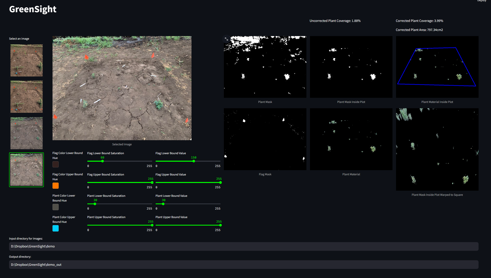

# GreenSight
A color-based image segmentation app designed to quickly estimate biomass (area) from photos of common garden plots. Requires 4-monochrome flags to mark the plot corners and known plot dimensions.

# Installing GreenSight

## Prerequisites
- Python 3.10 or later 

## Installation - Cloning the GreenSight Repository
1. First, install Python 3.10.10, or greater, on your machine of choice. We have validated up to Python 3.11.
    - Make sure that you can use `pip` to install packages on your machine, or at least inside of a virtual environment.
    - Simply type `pip` into your terminal or PowerShell. If you see a list of options, you are all set. Otherwise, see
    either this [PIP Documentation](https://pip.pypa.io/en/stable/installation/) or [this help page](https://www.geeksforgeeks.org/how-to-install-pip-on-windows/)
2. Open a terminal window and `cd` into the directory where you want to install GreenSight.
3. In the [Git BASH terminal](https://gitforwindows.org/), clone the GreenSight repository from GitHub by running the command:
    <pre><code class="language-python">git clone https://github.com/Gene-Weaver/GreenSight.git</code></pre>
    <button class="btn" data-clipboard-target="#code-snippet"></button>
4. Move into the GreenSight directory by running `cd GreenSight` in the terminal.
5. To run GreenSight we need to install its dependencies inside of a python virtual environmnet. Follow the instructions below for your operating system. 

## About Python Virtual Environments
A virtual environment is a tool to keep the dependencies required by different projects in separate places, by creating isolated python virtual environments for them. This avoids any conflicts between the packages that you have installed for different projects. It makes it easier to maintain different versions of packages for different projects.

For more information about virtual environments, please see [Creation of virtual environments](https://docs.python.org/3/library/venv.html)

---

## Installation - Windows 10+

### Virtual Environment

1. Still inside the GreenSight directory, show that a venv is currently not active 
    <pre><code class="language-python">python --version</code></pre>
    <button class="btn" data-clipboard-target="#code-snippet"></button>
2. Then create the virtual environment (venv_VVE is the name of our new virtual environment)  
    <pre><code class="language-python">python3 -m venv venv_VVE --copies</code></pre>
    <button class="btn" data-clipboard-target="#code-snippet"></button>
3. Activate the virtual environment  
    <pre><code class="language-python">.\venv_VVE\Scripts\activate</code></pre>
    <button class="btn" data-clipboard-target="#code-snippet"></button>
4. Confirm that the venv is active (should be different from step 1)  
    <pre><code class="language-python">python --version</code></pre>
    <button class="btn" data-clipboard-target="#code-snippet"></button>
5. If you want to exit the venv, deactivate the venv using  
    <pre><code class="language-python">deactivate</code></pre>
    <button class="btn" data-clipboard-target="#code-snippet"></button>

### Installing Packages

1. Upgrade numpy
    <pre><code class="language-python">pip install numpy -U</code></pre>
    <button class="btn" data-clipboard-target="#code-snippet"></button>
2. Upgrade matplotlib
    <pre><code class="language-python">pip install matplotlib -U</code></pre>
    <button class="btn" data-clipboard-target="#code-snippet"></button>
3. Install all other packages
    <pre><code class="language-python">pip install streamlit streamlit_image_select cv2 Pillow</code></pre>
    <button class="btn" data-clipboard-target="#code-snippet"></button>

---

# Launch GreenSight GUI
Use the terminal to `cd` into the `../GreenSight/` directory. Then simply run:
<pre><code class="language-python">python run_greensight.py</code></pre>
<button class="btn" data-clipboard-target="#code-snippet"></button>
or if that gives you trouble then:
<pre><code class="language-python">python3 run_greensight.py</code></pre>
<button class="btn" data-clipboard-target="#code-snippet"></button>

